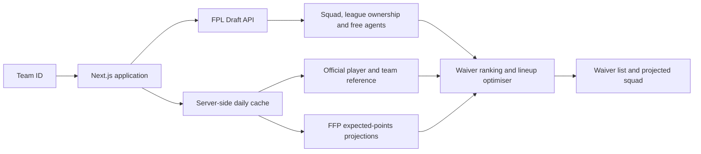

# DraftEdge

DraftEdge is an FPL Draft waiver planner that recommends league-specific player swaps over configurable short- to medium-term horizons.

Most fantasy advice is written for the standard FPL game or gives generic recommendations without considering league size, player ownership, or a manager's existing squad. DraftEdge instead checks the players who are actually available in a user's Draft league and compares them directly with the players that manager owns.

I built DraftEdge because I enjoy fantasy football and wanted one tool that could support different planning goals:

- **Short term:** improve the next gameweek.
- **Medium term:** target favourable runs across the next two to three gameweeks.
- **Longer term:** compare cumulative expected points across as many as five upcoming gameweeks.

## Demo

Live demo: **Coming soon**

<!-- Add a desktop screenshot here after deployment.

-->

## Key features

- Loads a manager's squad from a numeric FPL Draft team ID.
- Detects the manager's league and excludes every player already owned by another manager.
- Ranks same-position waiver swaps using cumulative expected-points gain.
- Supports configurable planning horizons from one to five upcoming gameweeks.
- Filters recommendations using an adjustable minimum expected-points gain.
- Prevents duplicate recommendations from adding or dropping the same player.
- Previews selected waiver claims in a single projected next-gameweek squad.
- Optimises the starting XI across every legal FPL formation.
- Displays expected points, the next fixture, team shirts, formation and bench order.
- Uses a responsive layout with a side-by-side desktop view and stacked mobile view.
- Fetches team, ownership and free-agent data live while caching shared projection data.

## Technology

- Next.js 16 and React 19
- TypeScript
- Tailwind CSS
- FPL Draft API
- Fantasy Football Pundit expected-points projections
- Vercel Functions, Data Cache and Cron Jobs

## Data flow and architecture



Team-specific data is requested live because squads, ownership and free agents can change throughout a gameweek. Shared player metadata and projections are cached server-side because they are identical for every user and are comparatively expensive to retrieve and parse.

The server joins players across the two sources using the official player code, calculates cumulative projection totals for each available horizon, and returns the current squad together with precomputed waiver recommendations. The browser handles only interactive filtering, claim selection and projected-lineup rendering.

## Waiver calculation methodology

For each horizon from one to five gameweeks, DraftEdge:

1. Fetches the manager's current 15-player squad and all unowned players in the detected league.
2. Groups owned and available players by FPL position.
3. Compares only position-preserving swaps, so every proposed claim leaves the squad structurally valid.
4. Calculates the cumulative gain:

   ```text
   waiver gain = available player's cumulative xP - owned player's cumulative xP
   ```

5. Removes non-positive swaps and sorts the remaining candidates by expected-points gain.
6. Produces up to 20 non-conflicting recommendations, preventing the same incoming or outgoing player from appearing more than once.

When claims are selected, DraftEdge applies them to the preview squad and chooses the highest projected next-gameweek XI across the eight legal formations:

`3-4-3`, `3-5-2`, `4-3-3`, `4-4-2`, `4-5-1`, `5-2-3`, `5-3-2`, and `5-4-1`.

The goalkeeper substitute is listed first, followed by the three outfield substitutes in descending next-gameweek expected points.

## Caching and cron design

The following data is always fetched live:

- Team and league details
- Player ownership
- The user's squad
- Available free agents

The following shared data is cached server-side for 24 hours:

- Official FPL player and team reference data
- FFP expected-points projections

`vercel.json` schedules a request to `/api/refresh` every day at `16:00 UTC`, which is midnight Singapore time. The endpoint invalidates the shared cache; the next analysis request repopulates it with fresh source data.

Production deployments should define `CRON_SECRET`. Vercel includes it as a bearer token when invoking the refresh endpoint, preventing arbitrary callers from repeatedly invalidating the cache.

## Technical trade-offs and limitations

- **External projections:** DraftEdge uses an established expected-points source rather than training another model. The product's value is league-aware Draft decision support, not reproducing projection modelling.
- **Source dependency:** The FFP integration parses data embedded in its public prediction page. A structural change to that page may require updating the parser. The ingestion step rejects unexpectedly small datasets instead of silently serving incomplete projections.
- **Pairwise ranking:** Recommendations are ranked as individual same-position swaps. The tool does not globally optimise a multi-claim waiver order against every possible combination or predict claims made by rival managers.
- **Lineup horizon:** Waivers can be evaluated across as many as five gameweeks, but the displayed starting XI is optimised specifically for the next gameweek.
- **First detected league:** If an entry belongs to multiple Draft leagues, the current implementation analyses the first league returned by the Draft API.
- **Public data only:** No FPL login, password or private account token is requested. A valid public Draft team ID is required.
- **Availability:** Projection accuracy and player availability depend on the upstream FPL and FFP data sources.

## Local setup

### Requirements

- Node.js 22.13 or newer
- pnpm 11.25.0

### Run locally

```bash
pnpm install
pnpm dev
```

Open [http://localhost:3000](http://localhost:3000) and enter the numeric team ID from an FPL Draft team URL.

### Production check

```bash
pnpm build
pnpm start
```

### Deploy to Vercel

Import the GitHub repository as a Vercel project and add a production environment variable named `CRON_SECRET`. The included `vercel.json` configures the daily refresh schedule.

## Disclaimer

DraftEdge is an unofficial, non-commercial fan project. It is not affiliated with, endorsed by, or associated with the Premier League, Fantasy Premier League, FPL Draft, or Fantasy Football Pundit.

Player projections are estimates rather than guarantees. Users remain responsible for their own waiver and lineup decisions. Team names, competition names and shirt imagery belong to their respective owners.
